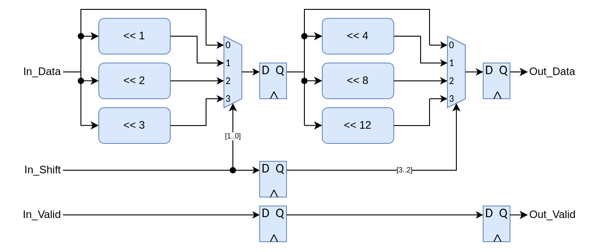

# olo_base_dyn_sft

[Back to **Entity List**](../EntityList.md)

## Status Information

  

VHDL Source: [olo_base_dyn_sft](../../src/base/vhdl/olo_base_dyn_sft.vhd)

## Description

This entity implements a dynamic shift (barrel shift) implemented in multiple stages in order to achieve good timing. The number of bits to shift can be selected at runtime for each data-sample.

## Generics

| Name              | Type     | Default | Description                                                  |
| :---------------- | :------- | ------- | :----------------------------------------------------------- |
| Width_g           | positive | -       | Data width                                                   |
| Direction_g       | string   | -       | Direction to shift. Allowed values are "LEFT" (shift towards MSB) and "RIGHT" (shift towards LSB). |
| MaxShift_g        | positive | -       | Maximum number of bits to shift.  *MaxShift_g* must be smaller or equal to *Width_g*. |
| SignExtend_g      | boolean  | false   | Controls whether the sign bit is replicated (true) or zeros are shifted in (false) for *Direction_g* = "LEFT". *true* is used to perform arithmetic left-shifts for signed numbers. |
| SelBitsPerStage_g | positive | 4       | Number of bits from *In_Shift* to implement in each stage. This parameter controls how many pipeline stages are implenented: *Stages* = *ceil(log2(MaxShift_g+1))/SelBitsPerStage* Smaller values lead to better timing performance, bigger values to less stages (less latency). |

## Interfaces

### Control

| Name | In/Out | Length | Default | Description                                     |
| :--- | :----- | :----- | ------- | :---------------------------------------------- |
| Clk  | in     | 1      | -       | Clock                                           |
| Rst  | in     | 1      | -       | Reset input (high-active, synchronous to *Clk*) |

### Input Data

| Name     | In/Out | Length                     | Default | Description                                                 |
| :------- | :----- | :------------------------- | ------- | :---------------------------------------------------------- |
| In_Data  | in     | *Width_g*                  | -       | Input data                                                  |
| In_Shift | in     | *ceil(log2(MaxShift_g+1))* | -       | Number of bits to shift the corresponding *In_Data* sample. |
| In_Valid | in     | 1                          | '1'     | AXI4-Stream handshaking signal for *In_Data*                |

### Output Data

| Name     | In/Out | Length    | Default | Description                                   |
| :------- | :----- | :-------- | ------- | :-------------------------------------------- |
| Out_Data | out    | *Width_g* | N/A     | Output data                                   |
| In_Valid | out    | 1         | '1'     | AXI4-Stream handshaking signal for *Out_Data* |

## Architecture

Below figure shows the implementation for *MaxShift_g=15* and *SelBitsPerStage_g=2*. 

For example a shift by 7 bits is implemented as shift by 3 bits in the first stage plus shift by 4 bits in the second stage.

